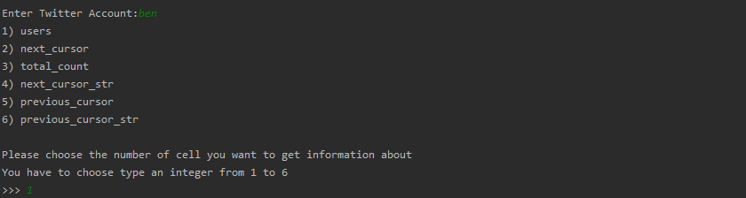

# Description
This project was launched to provide anyone willing to know more about their Twitter friends with more information. If the user wants to know a bit more about his/her (100 is maximum) friends, he/she can use this application. The application provides the user with geographic, status, followers and other kind information of his/her friends.

To launch the application you need to download whole repository and run twitter.py (do not forget to write your keys in access.py)
--------------------------------------------------------------------------------------------------------------------------------------
## Run examples

