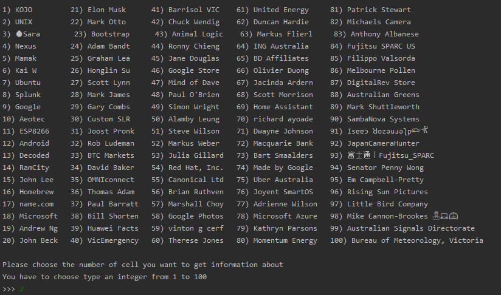
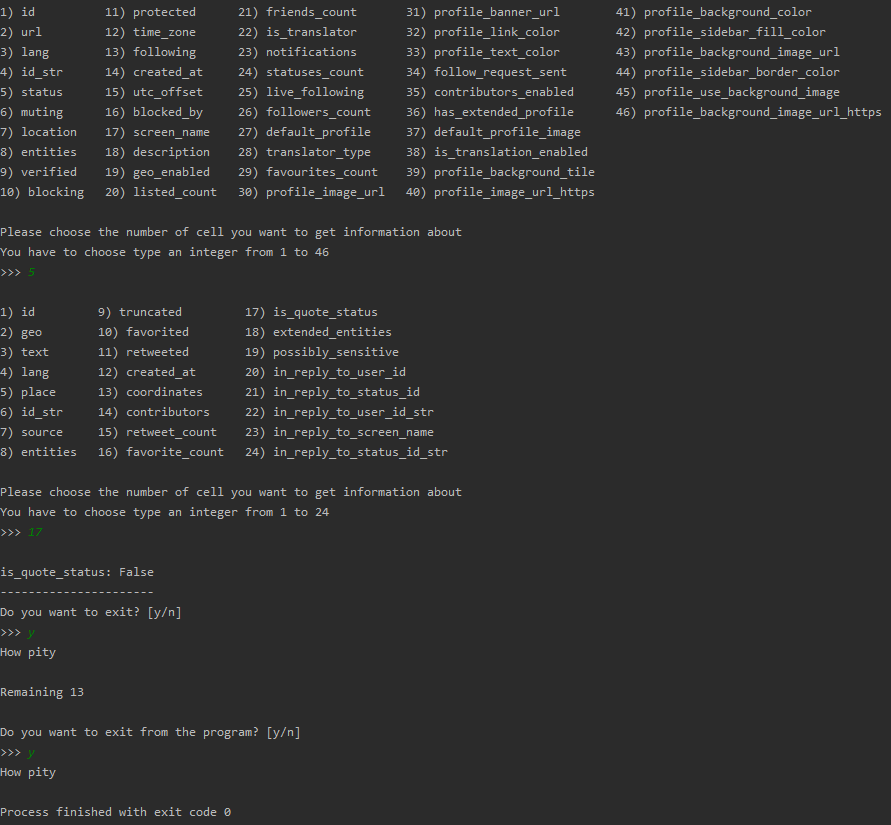

# Description
This project was launched to provide anyone willing to know more about their Twitter friends with more information. If the user wants to know a bit more about his/her (100 is maximum) friends, he/she can use this application. The application provides the user with geographic data, status, followers, and other kind information of his/her friends. With this application, the user can explore the JSON file provided by Twitter from the title until the end. Using this app may enforce users' knowledge about the JSON data structure. In other words, the goal of this project is somehow accademic.

To launch the application you need to download whole repository and run twitter.py (do not forget to write your keys in access.py)
--------------------------------------------------------------------------------------------------------------------------------------
## Run examples

